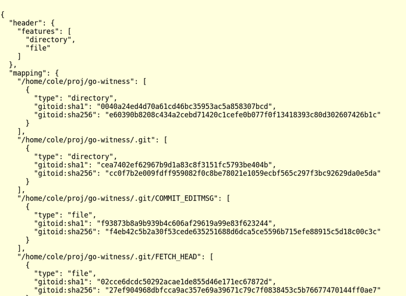

# SBOMit Specification

This document serves as the 0.1.0 specifications for SBOMit (SBOM on in-toto). The specification should not be considered stable at this time.

## 1 Introduction

### 1.1 Scope

This project, SBOMit, an emergent open-source initiative, aims to fortify software supply chain security by enhancing the reliability and integrity of Software Bills of Materials (SBOMs). By making SBOMs tamper-proof and accurate, it mitigates the risk of malicious attacks. Backed by the reach of OpenSSF and the Linux Foundation, the project helps deploy these security standards globally. It also enhances transparency in the software supply chain by offering standardized, dependable information about software elements. Its open-source design promotes industry-wide collaboration, leading to a tool that evolves to meet dynamic security needs.

### 1.2 Motivation

Software Bills of Materials (SBOMs) often suffer from inaccuracy, primarily due to a retrospective approach to software analysis that fails to accurately track components. This challenge is becoming more pressing with the rise of sophisticated supply chain attacks requiring advanced technology and robust frameworks like the Secure Software Development Framework (SSDF) for comprehensive security. The SSDF emphasizes security at every development stage and, in combination with accurate and tamper-proof SBOMs, significantly bolsters supply chain security. Thus, an accurate SBOM forms a solid foundation for enhancing the software supply chain's resilience against increasingly complex and frequent cyberattacks.

This specification proposes a means to generate metadata for an SBOM while the software is being created. Furthermore, the means by which this information is captured uses [in-toto](https://in-toto.io) attestations and layouts. This provides cryptographic validation that this information is correct, handles key distribution and management to indicate which parties should be trusted for each step, and captures information about the environment in which the steps are run.

As a result, using SBOMit provides a more accurate SBOM when parties are honest. When malicious parties interfere in the process, SBOMit provides a mix of traceability (knowing which party was malicious) and prevention (blocking malicious software from being trusted), depending on how the in-toto steps are configured.

### 1.3 History and credit

July, 2023 -- Version 0.1.0 of this document is drafted

### 1.4 Context

A Software Bill of Materials (SBOM) is an inventory of all components in a piece of software. These components can be anything from open-source libraries, proprietary modules, or previously written code snippets, which are all considered to be part of the larger, final product. SBOMs are becoming increasingly important in the context of software security, compliance, and quality, as they provide a transparent view of the building blocks of a software product.

### 1.5 Terminology

* **SIT:** refers to an SBOM (Software Bill of Materials) that has been derived from an SBOMit document. It can be formatted in any SBOM style and references the originating SBOMit document used for its creation.
* **SBOMit Document:** is a comprehensive document containing ample information to validate the correctness of the supply chain process. It can be utilized to generate one or more SITs.
* **Software Supply Chain (SSC)**: This represents the sequence of actions taken to create a software product, generally starting from users committing to a version control system and ending with the installation of the software product on a client's system.
* **Supply Chain Layou**t: Also referred to as a layout or layout metadata, this is a signed file that defines the series of steps to be followed in the SSC to create a final product. It details ordered steps, requirements for these steps, and the list of actors or functionaries responsible for executing each step. The steps within the supply chain are established by a project owner. Sublayout: A supply chain layout that describes steps as part of another supply chain layout.
* **Project Owner**: This person is the authoritative figure within a project. The project owner dictates which steps are to be carried out in the supply chain, and who is authorized to carry out each step (i.e., define the layout).
* **Functionary**: This term refers to an individual or an automated script tasked with performing an action within the supply chain. For instance, the entity in charge of compiling a project's source code is a functionary.
* **Supply Chain Step**: This represents a single action in the software supply chain, executed by a functionary.
* **Link**: This refers to metadata information collected while executing a supply chain step or inspection, signed by the functionary that carried out the step or the client who performed the inspection. The metadata can include information such as materials, products, and byproducts.
* **Materials**: These are the elements (e.g., files) utilized to perform a step in the supply chain. Files generated by one step can be materials for a subsequent step.
* **Product**: This is the outcome of a step. Products are usually persistent (e.g., files) and are often used as materials in subsequent steps. Products are recorded as part of link metadata.
* **Artifact**: This term can refer to either a material or a product.
* **Byproducts**: These are the indirect outcomes of performing a step, typically used to verify the correctness of a step. Byproducts are information that won't be used as material in a subsequent step but can provide insight into the process. Examples of byproducts include stdout, stderr, and return values. Byproducts are recorded as part of link metadata.
* **Final Product**: This is the bundle containing all the files required for the software's installation on the client's system. This includes link metadata, layout metadata, target files, and any additional metadata required for the product's verification.
* **Client Inspection Step**: This is a step carried out on the client's machine to verify the information contained in the final product. Client inspection steps also generate link metadata that can be utilized by sub-layouts and other inspection steps.
* **Verification**: This is the process whereby the data and metadata included in the final product are used to ascertain its correctness. Verification is performed by the client by checking the supply chain layout and links for correctness and by performing the inspection steps.
* **Target Files**: These are any files that are not part of in-toto metadata (i.e., not a layout or a link file). In the case of an installer, these files will often be unpacked from within the final product and prepared for use on the user’s system.

### 1.6 Goals

SBOMit seeks to address existing vulnerabilities by facilitating the generation of Software Bills of Materials (SBOMs) that act as a robust shield against software supply chain weaknesses. These SBOMs offer cryptographic validation of the materials used in the software supply chain. Our goal is to improve SBOM accuracy and significantly raise the bar for any attempts to tamper with the supply chains they represent.

#### 1.6.1 Goals for Implementation

1. The framework's client-side implementation should be simple and compatible with any programming language and platform that supports the necessary cryptographic functions.
2. Integration of the framework should be effortless with existing tools, such as installers, build systems, testing frameworks, version control systems, and software update systems.
3. The framework should be easily customizable to work with any cryptographic library.
4. The procedures for functionaries to gather metadata about the steps carried out should be simple and nonintrusive. The same simplicity and non intrusiveness should apply to the processes by which project owners define the supply chain.

#### 1.6.2 Goals and Non-goals

**Goals:**

Goals for Compatibility and User Experience:

* Maintain compatibility with existing SBOM formats (potentially generating these existing SBOMs), with a preference for operability with initiatives like SPDX, CycloneDX, and similar efforts.
* Define use cases and outcomes, prioritizing end-user experience and machine readability.
* Prioritize usability and user onboarding, a facet recognized as crucial by various stakeholders.
* Incorporate multilingual tooling for broader accessibility.

Goals for Security and Verification:

* Ensure cryptographic verification that precisely reflects the steps performed as outlined in the SBOMit document, addressing OSS-RISK-9 and OSS-RISK-5.
* Adopt a threat model that accounts for an attacker capable of compromising any part of the software supply chain, addressing numerous attacks listed under OSS-RISK-2.
* Clearly define the elements of the resulting SBOM that are cryptographically verifiable from in-toto attestations and policies.
* Utilize the in-toto delivery bundle for the distribution of a single file.
* Clearly define a threat model that can uncover potential vulnerabilities, significantly strengthening the system's overall security posture. ([in-toto Security Audit Response](https://www.testifysec.com/blog/in-toto-sec-audit-response/))

Goals for Data Capture and Accuracy:

* Facilitate the optional capture of pertinent information about the runtime environment of supply chain steps, including pre-build, post-build, and all other phases, which aids in addressing many attacks in OSS-RISK-2.
* Ensure a comprehensive and accurate representation of the software described in the resulting SBOMit document, aiding users in identifying issues associated with OSS-RISK-1, OSS-RISK-5, and various other listed items.
* Enable the optional capture of output from scanning tools or similar that may generate inferences. While this information might be based on incomplete or incorrect data, its presentation can be beneficial.

Goals for Documentation and Clarity:

* Provide a clear specification that other groups can implement for SBOMit.
* Offer examples of the necessary tooling for generating and processing SBOMit documents.
* Ensure that users of SBOMit documents can clearly understand the steps performed, potentially facilitated by plugins through tools like Testify, SLSA, GUAC, FRSCA, etc.

**Non-goals:**

Things we couldn’t handle, but other tools may help.

Our endeavor is not established to champion a particular SBOM format such as SPDX or CycloneDX. Moreover, it abstains from involvement in the mechanism by which users determine the accurate name or root of trust for the software they install, an issue related to OSS-RISK-3. The project also does not extend its ambit to examine the components, such as packages inside a container image, if the build process doesn't inherently do so, a situation associated with OSS-RISK-6. As the tooling and the utilization of in-toto amplifies, it is anticipated that this concern will be organically addressed with time.

**Our project is not structured to make judgments about whether a particular action amounts to a sound security practice**, an issue linked to OSS-RISK-8. Concerns about the quality of tool implementation or security processes that describe how the SBOM or artifact was produced, which also correspond to OSS-RISK-8, are not immediate obligations of the project.

In addition, we are not mandated to conclude whether a dependent software project is adequately maintained and appropriate, an issue associated with OSS-RISK-4 and OSS-RISK-10. Lastly, the accountability of determining the appropriateness of a specific license, an issue related to OSS-RISK-7, is beyond our project's commitments. These issues are more suitably handled by a structure like SLSA or deferred to the user's judgment.

#### 1.6.3 Assumptions

First, client-side tools should handle key-management on behalf of the user. Except for the layout key, the client isn't obligated to retrieve or provide keys for verification. We've detailed how complementary frameworks like The Update Framework (TUF) can securely distribute a layout and its keys. When it's relevant, a functionary should be able to delegate full or partial trust to other functionaries to execute steps on their behalf. Additionally, support for remote attestation adds another layer of security, ensuring that the device is running authentic, unaltered software.

#### 1.6.4 System properties

To achieve the goals stated above, we present a system with the following properties:

1. Firstly, it assures final product authentication and integrity. The client can be confident that the product they receive was created by the intended functionary and that it matches bit-by-bit the contents of the final product reported by the last step in the supply chain.
2. Secondly, it guarantees process compliance and auditability. The client's product adheres to the layout specified by the project owner. All described steps are correctly linked, and, if audited by a third party, they can verify that all steps were performed as described. For instance, the in-toto metadata may reveal the unit test server’s signed confirmation that the software passed all its unit tests, or it may validate that a certain code review policy was employed by checking git commit signatures.
3. Furthermore, it ensures traceability and attestation, facilitating the identification of conditions under which each supply chain step was performed, the materials used, and the resulting products.
4. The system also provides step authentication, meaning that the actor executing various supply chain steps provides unforgeable evidence of the step. For example, if Alice tagged a release, the provided evidence could only be produced by Alice.
5. Moreover, the system facilitates task and privilege separation, allowing different supply chain steps to be assigned to different functionaries. For example, if only Alice is authorized to tag a release, releases tagged by Bob will not be trusted in the supply chain.
6. Lastly, the framework should offer an interface to interact with client systems that further verify the integrity of each step.

## 2 System Overview

The main goal of SBOMit is to construct decentralized trust mechanisms with the intention of making the process of deploying software more efficient and straightforward. It accomplishes this by providing a flexible and customized approach, thereby accommodating individual organizational processes. By moving away from conventional code signing methodologies, SBOMit is engineered to offer supplemental information, even if it is not entirely trusted. The goal is to encapsulate and convey code signing trust information effectively, ensuring it resonates with end-users across various communities.

The following are the high-level steps for deploying the framework, as seen from the viewpoint of an adopter. This is an error-free case:

1. Examination and Candidate Description Creation: A developer, aspiring to fortify their software supply chain and generate an SBOM (or equivalent), runs a specific tool on their constructed software. This tool yields a candidate SBOMit layout for the developer. Although this step is technically optional, it facilitates the ensuing step.
2. Data Collection through Pipeline Instrumentation: Subsequently, the developer recreates their software release process with an encompassing wrapper that collects software supply chain metadata in in-toto attestations. This method automatically generates cryptographic identities for each host involved in the software supply chain steps. Any discrepancies are relayed to the developer for either approval or inspection.
3. Data Verification against Policy/Layout: The final stage of the release process is set up as verification. Upon completion, the developer can cryptographically confirm that their supply chain has executed the actions specified in the SBOMit document, through validation on the SBOMit document itself.

### **2.1 Involved parties and their roles**

In the context of SBOMit, a role is a set of duties and actions that an actor must perform.

In the following role descriptions, keep in mind that the framework has been engineered to allow significant flexibility to accommodate various use cases. Given that each project employs a unique set of tools and practices, this is a necessary feature for SBOMit.

There are three primary roles within the framework:

1. **Project Owner**: This role is entrusted with the task of defining the layout of the software supply chain, serving as the root of trust within the system
2. **Functionary**: This role performs a step in the generation of SBOMs and furnishes a piece of link metadata as a record demonstrating that such a step was carried out
3. **Client/Verifier**: This role is responsible for performing verification on the final product by checking the provided layout and link metadata.

These roles are further elaborated on below:

#### **2.1.1 Project Owner**

As previously outlined, the project owner determines the steps to be performed in the supply chain. For each step, they specify the requirements and the specific public keys that can sign for evidence of the step to ensure compliance and accountability. Additionally, they write the policy (in-toto layout) and the layout file will contain the definition of inspection steps to be executed when verifying the final product.

#### **2.1.2 Functionaries**

Functionaries are tasked with performing steps within the supply chain and providing evidence of this by means of link metadata.

A functionary is uniquely identified by the public key they use to sign a piece of link metadata, serving as evidence that a step within the supply chain was performed.

A functionary may perform a step or a series of steps (e.g. adds supplemental information that will appear in an SIT) in the supply chain to a third-party via a sublayout. In this scenario, a subset of the steps to be performed is defined by the functionary, who assumes the role of a project owner for this sublayout.

#### **2.1.3 Clients/Verifier**

Clients are either users or automated tools that intend to use the SBOMit.

In the final stages of the process, the client performs comprehensive verification of the product. This procedure involves several key steps:

1. Verification of the layout metadata: The client checks the structure and integrity of the layout to ensure it adheres to the predefined specifications.

2. Alignment check between link metadata and layout: This step confirms that the provided link metadata is consistent with the layout detailed in the metadata.

3. Execution of inspection steps: The client carries out inspections to verify if the additional metadata and target files comply with the criteria outlined in the layout for this specific inspection step.

4. In-toto layout verification: This involves examining the in-toto layout over the provided in-toto metadata to ensure its consistency and correctness.

5. SIT verification and generation: Each Software Inventory Template (SIT) is checked to ensure it is appropriately signed by the correct SIT generator. Furthermore, each SIT is generated using relevant tooling, facilitating a detailed examination of the mutator behavior. Through these stringent measures, the client can ensure the robustness of the final product, aligning with the high-security standards set by the project.

### 2.2 Threat model

One key goal of our design is to provide as much security as possible in all cases. Security should degrade gracefully when the attacker gains new capabilities. Hence, we will consider attacker models where the attacker is exceedingly powerful and try to restrict the damage they can do even in those cases.

There are two types of protection SBOMit commonly provides:

* traceability -- this enables a party with an SBOMit document and the supply chain to later determine which parties acted in a malicious manner. Note that this may require some further manual analysis (e.g., to determine if an emitted binary is actually a correct output of a build server given a set of source code). However, importantly, properties like non-repudiation hold, so that a party cannot appear to be innocent given a re-execution of a supply chain with all honest participants.
* prevention -- this is when an attack is blocked from having any impact. This often occurs because an attack causes some aspect of validation to fail, resulting in no impact to the end user. This can include situations like an inability to inject malicious metadata into the supply chain, a policy check in an in-toto layout causing a resulting SBOMit document to be rejected, or an inability to sign because of a lack of access to a private key trusted for that signature.

Note that a party verifying a SIT (only) does not gain the same security guarantees. They instead gain the same sort of guarantees that signed SBOMs have today. However, the SIT contains a reference to the SBOM document, so it may be used to obtain the necessary information to perform more complete verification.

The actors of the system are the following, each of whom possesses a unique private key:

* a series of in-toto functionaries that perform the actual steps of the software supply chain. For example, a build server is a functionary.
* a SIT mutator (per SIT), which is a process that adds supplemental information that will appear in an SIT. This is likely performed by a combination of human actions (e.g., listing supplemental information) and automated tooling (e.g., adding information for a specific extended SBOM format).
* a SIT generator (per SIT), which generates the actual SIT file.
* an in-toto layout creator, who specifies the keys used by other parties and writes the policy (in-toto layout) that indicates how different steps of the software supply chain interrelate. This party also serves as the SBOMit root-of-trust.
* a (possibly empty) set of in-toto sub-layout creators. These are identical in action to the in-toto layout creator, but they are only trusted for the subset of the layout which the layout creator delegates.

We are able to limit attacker damage and/or trace the location of the compromise(s) in cases where:

* an attacker may possess cryptographic keys for any of the functionaries (the parties performing the software supply chain steps) in the system. \
_Impact:_ Prevents modification of items not allowed by the in-toto layout. Provides traceability in all cases. No impact without the ability to interject this metadata into the supply chain.
* an attacker may tamper with one or more steps of the software supply chain. For example, the build process, testing, packaging, etc. \
_Impact:_ Identical to the prior case.
* an attacker obtains a sub-layout key. Note that this also requires the ability to inject sublayout metadata into the supply chain such that other parties include it. _Impact:_The impact could be prevented depending on the restrictions placed upon the delegated sub-layout. However, traceability always exists. This is also similar to a functionary compromise.
* an attacker may become a man-in-the-middle between any steps of the system. _Impact:_Without further capabilities, this has no impact.
* an attacker may possess the key used to sign the SBOM resulting from the SBOMit process.  \
_Impact:_ Prevention for parties performing full SBOMit verification. Traceability otherwise.
* an attacker may compromise an SBOM mutator key or an SBOM mutator may act maliciously.  \
_Impact:_ Traceability in all cases. Depending on the changes made to the SBOM, this may be detected by review of the resulting SBOM. Changes that override in-toto derived information are specifically flagged and unlikely to be accepted.
* an attacker is able to compromise a SIT generator key or a SIT generator directly.  \
_Impact:_ Protection for clients who obtain the SBOMit document. Traceability for other clients. Note that the SIT will contain a reference to the SBOMit document, but this also may be modified in this case. However, the client should have the in-toto layout key and so will notice this action if retrieving the SBOMit document from the SIT.
* an attacker is able to compromise the in-toto layout key, which serves as the root-of-trust for the system.  \
_Impact:_ Traceability. Later analysis can show this was the cause, but users will trust a new, maliciously generated layout which replaces signing keys.

From [Endor Lab's top 10 OSS risks](https://www.endorlabs.com/blog/introducing-the-top-10-open-source-software-oss-risks), our design largely addresses:

* OSS-RISK-1
* OSS-RISK-2
* OSS-RISK-5
* OSS-RISK-9

Orthogonal systems that can be used along with SBOMit:

* A software supply chain tool which attests to the quality of steps, such as FRSCA and SLSA. This helps with knowing that an individual action is actually a good security practice, could judge the quality of implementation for different tools, determine if the code base metrics are indicative of quality, understand if the license is appropriate, etc. This helps to address OSS-RISK-4, OSS-RISK-8, and OSS-RISK-10. OSS-RISK-7 may also be addressed either by this or by end user diligence.
* Some means like Sigstore's root of trust is needed to handle how users know the correct name / root of trust for the software they are installing. This relates to OSS-RISK-3.
* Recursing into components like the packages inside of a container image when the build process does not otherwise do so. This relates to OSS-RISK-6. As both tooling and in-toto adoption increase, this issue should naturally be addressed as more metadata becomes available.

There is also a more detailed analysis that shows why these properties hold.

### 2.3 SBOMit components

An implementation of SBOMit is composed of four primary components:

1. In-toto Layout Management Tool: Dictates the supply chain policy, including details about keys for each SIT and the SIT generation process. It is signed with a trusted layout key.
2. In-toto Metadata Collection Tool: Manages a range of in-toto metadata like sub-layouts, link metadata, and attestations, which are validated and signed by the appropriate parties.
3. SBOM Mutation Tool: Creates metadata for mutating the derived SBOM information to enhance its completeness. The metadata is in ISO or JSON patch format.
4. Addendum Handling Tool: Handles addendums or modifications, represented as diffs to the previous document sections, preserving historical information. Also uses JSON patch format.

### 2.4 System Workflow Example

#### **2.4.1 Actual Implementation:**

Step 1: To make an easier adoption path for existing software, the first (optional) step is to generate a candidate layout.  To do this, we would utilize a scanning tool like [SBOM X-ray](https://sched.co/182GT) to generate a candidate SBOM or an in-toto layout by inspecting a provided software package or binary. However, we wouldn't fully populate the in-toto layout with functionary keys or detailed verification for link metadata for two reasons. Firstly, we lack accurate knowledge of the materials and products passed between links as we haven't witnessed the earlier parts of the software supply chain in sufficient detail. Secondly, it's better to have keys generated on systems performing the software supply chain steps, so the public keys of the functionaries can't be included in the in-toto layout at this stage.

Step 2: Each step of software creation would be executed with a wrapper script. A registry like [Testify’s Archivist](http://github.com/testifysec/archivist) or could be used for data tracking, or the data could be manually copied alongside the software artifact being built. The wrapper script would operate similarly to 'in-toto run,' possibly with an option to generate functionary keys. The script should perform the following for each supply chain step it executes:

* Capture link metadata for the performed step. Integration of this action in scripts and CI/CD systems is encouraged for consistent performance.
* Optionally capture environmental information, installed packages, etc. One option is to use runtime trace attestations to gather this information. Again, this could be integrated into scripts for consistent performance.
* Stitch links into the layout as it runs, adding supplemental information into the SBOM areas. This includes matching materials and products from other link steps.
* Periodically run 'in-toto verify' over the partial Verifiable SBOM to provide immediate feedback to developers, enabling prompt resolution of missing steps and issues. Developers can resolve issues in several ways:
    1. They can indicate how a step, corresponding to a link, fits into the layout if an error was made by the tooling.
    2. If the scanning tool missed a step, they can add a link for that step and update the layout accordingly.
    3. If an expected step in the layout isn't present in the actual project, they can remove it.
    4. If there's an unexpected or unwanted step in the supply chain, they can modify the project to remove it. Missing steps and information are highlighted, ideally using a visualization tool like [GUAC](https://security.googleblog.com/2022/10/announcing-guac-great-pairing-with-slsa.html), which offers a comprehensive view of the process and mitigates [https://github.com/in-toto/docs/security/advisories/GHSA-p86f-xmg6-9q4x](https://github.com/in-toto/docs/security/advisories/GHSA-p86f-xmg6-9q4x)
* Depending on the developer or organization's needs, the wrapper could have multiple modes: fail-safe (halting the build if any step is invalid), Notify (providing real-time notifications), and Log (providing a summary of actions after the artifact is packaged).

Step 3: Set up 'in-toto-verify' to run on the layout and only proceed with the release if it passes. Distribute the link metadata and Verifiable SBOM to end users, potentially via a registry. The method to refer to link metadata and other Verifiable SBOMs can be either via hashed references to an attestation or a bundled file containing everything.

Stable State: In-toto verification will run every time a release is performed. This provides strong guarantees and should be essentially automatic. If steps change, the Verifiable SBOM’s in-toto layout will need modifications, and Step 2 may need to be performed for the new functionary. The Verifiable SBOM can be exported into various SBOM formats, including SPDX, CycloneDX, etc. Any information required for these that aren't needed for an in-toto layout (and thus not used for verification) can be modified independently in the Verifiable SBOM, and the document may be re-signed for authenticity and integrity verification.

#### **2.4.2 Use Case Scenarios:**  

1. Large financial corporations and major defense contractors are examples of entities that receive Software Bills of Materials (SBOMs) in the cycloneDX format and require verification of the deliverable's integrity.
2. In the case of a prominent bank, they require validation of the supply chain security posture of an external build or SBOM generation environment against a specific policy. The attested information relevant to this process is then stored in an SBOMit document.
3. For major defense contractors, the use case involves the generation of signed SBOMs (cycloneDX) of deliverables across disconnected environments. These SBOMs are subsequently inspected by Security Officers.
4. In the context of big financial institutions, there's a need to validate the supply chain security posture of an external source in a codified manner. This extra data helps determine whether to trust the external source or SBOM. This could potentially be achieved by examining and attesting to the security posture of the Software Development Life Cycle (SDLC) or tooling used to build the software and SBOM. This attested information would then be referenced in the SBOMit document."

## 3 The Final Product

The final product is the bundle of a series of in-toto attestations, a complete (standard) in-toto layout, and any additional supplemental information that may be required. This bundle is called a SIT and can be represented can be represented in different Software Bill of Materials formats and versions, but must represent or link to the required data in a consistent fields that can clearly mapped to existing and future Software Bill of Materials formats.

### 3.1 Contents

#### 3.1.1 in-toto attestations

Primarily, the bundle encompasses a sequence of in-toto attestations, each of which is generated throughout the creation of the described software. These attestations provide a granular view into different stages of the software supply chain, which could include elements such as version control system, build process, unit testing, dependencies, fuzzing, license compliance checks, and packaging among others. For instance, an in-toto attestation for the build system used to compile the software in the SBOM might comprise the names and secure hashes of files sourced from the VCS for compilation, the names and secure hashes of files generated during the compilation process, comprehensive data about the compiler, and a signature endorsed by the compiler's private key.

#### 3.1.2 in-toto layout

Working in tandem with these attestations is the in-toto layout, another key component in the SBOMit document. Authenticated by the project owner's signature, the layout provides a blueprint of what constitutes valid attestation metadata for the project. It stipulates the private keys for entities performing the attestations and elucidates the interconnections between different steps. This means it could specify, for example, that a signed git tag from the VCS should be the basis for the build system's operation, and that the files compiled by this system should be the same ones subjected to unit tests, all of which must be passed. Crucially, an in-toto layout translates to a machine-readable policy capable of validating in-toto attestations, thereby ensuring every stipulated step was executed in the right sequence, on the correct items, and without any steps being skipped, added, or omitted.  

#### 3.1.3 Additional supplemental information

Finally, the SBOMit document includes supplemental SBOM information. Together with the in-toto attestations and layout, this information can be utilized to generate a final SBOM in a variety of formats. The supplemental SBOM data might encompass details such as the company name and other specifics that aren't incorporated in-toto but are nonetheless relevant for inclusion in the resultant SBOM. Thus, an SBOM derived from an SBOMit document can feature supplementary data that wasn't part of the in-toto procedure.

## 4 Document Formats/Required Fields

### 4.1 SBOMit Document

#### 4.1.1 Overview

There are four items in a SBOMit document:

* An in-toto layout. This specifies the policy that the supply chain followed. This includes information about the key used to sign each SIT and corresponding the SIT generation process for each. It must be signed by the layout key trusted for the SBOMit document.
* A collection of in-toto metadata. This includes sub-layouts, link metadata, and attestations. This must validate according to the in-toto layout and so must be signed by the appropriate functionaries and sub-layout creators.
* The SBOM mutation. This metadata describes how to mutate the SBOM information derived from the in-toto metadata. It essentially serves to flesh out the derived SBOM to make it more complete that what can be strictly verified. This is in ISO or JSON patch format.
* Zero or more addendums. These are represented as diffs to the prior sections of the document. It enables one to easily append or modify information while retaining historical information. These are also in JSON patch format.

#### 4.1.2 Detailed format

### 4.2 SIT

#### 4.2.1 Overview

A SIT is a valid SBOM (of any type), with the following two constraints:

* it has a field indicating the SBOMit document that it was derived from.
* it is signed by the functionary key listed in the related step of the in-toto layout

#### 4.2.2 Detailed format

There are two required fields independent of SBOM format:

* **Hashes** Sha256 hashes for every component matching hashes used in in-toto link attestations
* **Annotations/Properties** or **External References** to in-toto attestations, in-toto layout, and additional supplemental information

#### 4.2.2.1 **Hashes** Field

Components are identified through sha256 hashes. To allow tracability between components, in-toto attestations, and other metadata

* The specification shall require all components to have hashes.
* The specification shall use component hashes using sha256 to match the [in-toto attestation specification](https://github.com/in-toto/specification/blob/v1.0/in-toto-spec.md#423-hash-object-format).

#### 4.2.2.1.1 CycloneDX 1.2 - latest

CycloneDX has support for hashes in sha256 for versions `1.2` - `latest`. The declared `alg` needs to be `SHA-256` and the `content` needs be the sha256 content of the component. This checksum must match the hashes used in the in-toto link attestations.

* `metadata.component.hashes[]`
  * `alg: SHA-256`
  * `content: <component hash>`
* `components[].hashes[]`
  * `alg: SHA-256`
  * `content: <component hash>`

#### 4.2.2.1.2 SPDX 2.3

SPDX has support for hashes (checksums) in SPDX `2.3`. The declared `algorithm` needs to be `SHA256` and the `checksumValue` needs to be the sha256 content of the component. This checksum must match the hashes used in the in-toto link attestations.

* `packages[].checksums[]`
  * `algorithm: SHA256`
  * `checksumValue: <component hash>`

#### 4.2.2.1.3 SPDX 3.0

SPDX has support for hashes (checksums) in SPDX `3.0`. The declared `checksum` needs to use the sha256 algorithm. This checksum must match the hashes used in the in-toto link attestations.

* `components[]`
  * `checksum: sha256:<component hash>`

#### 4.2.2.2 **Annotations/Properties** Field

Software Bill of Materials documents link attestations and layout files through annoations/properties. While not ideal, until there is clear mappings between CycloneDX and SPDX to include in-toto attestations and in-toto layout files.

Until then, annotations/properties will be used to link and embed in-toto files into Software Bill of Materials. The following annotation/property taxonomy will be used.

* `sbomit:attestation:urls`
  * A comma separate list without spaces of urls to attestations
  * Example: `sbomit:attestation:urls`: `https://search.sigstore.dev/?uuid=24296fb24b8ad77a015df1bc74d136caf352a8e23c12eda8fd1c89f10d49a31aa1a239c70de3996e,https://search.sigstore.dev/?logIndex=94408136`
* `sbomit:attestation:contents`
  * A comma separate list without spaces of base64 encoded attestations
* `sbomit:layout:urls`
  * A comma separate list without spaces of urls to layouts
* `sbomit:layout:contents`
  * A comma separate list without spaces of base64 encoded attestations

Attestations and layouts can be associated with any component in the SBOM. This is needed since in-toto attestations can attest to multiple components (outputs). A best effort should be taken to associate the attestations and layouts with the component it best describes.

## 5 Detailed Workflows

There are two main workflows for SBOMit documents and SITs: generation and verification.

### 5.1 Generation

#### 5.1.1 SBOMit document

To generate a SBOMit document, one must generate the constituent parts. For the in-toto layouts, sub-layouts, attestations, and links, this process is described in the in-toto project's documentation. Note, however, that for the purposes of SBOMit, the layout is required to include certain information such as, … so that this information may be used to populate the SIT.

Generating the mutator by hand may be done by starting with a null mutator and then using tooling to generate a SIT in the correct format. The SIT file may be modified and the JSON diff may be computed.

Similarly, if a SBOMit document is modified, one may elect to add an addendum to modify it instead of generating a fresh document. This is easily done by generating the new SBOMit document and then creating a JSON diff.

#### 5.1.2 SIT

The SIT is generated by first deriving common information from in-toto and placing it in an intermediate format called X. This format is effectively an SBOM itself which matches the NTIA format.

Then the tool specified in the layout may be used to derive the SIT in the appropriate end format. Note also, that multiple SITs may be generated from the same SBOMit document. So, for example, one SBOMit document could generate both a SPDX SIT and a CycloneDX SIT.

An important part of generating the SIT is applying the mutator to the output of the tool used to derive the SIT. This adds or modifies information in the resulting SIT as instructed. This works as though applying a JSON patch to the SIT document.

It is recommended that the SIT generation tool provides a warning if the mutator modifies (e.g., replaces or removes) portions of the SIT derived from the in-toto information. This is because this will be flagged as a security risk when verification of the SBOMit document is performed.

### 5.2 Verification

#### 5.2.1 SBOMit document

SBOMit document verification proceeds by the following steps:

* verifying the in-toto layout over the provided in-toto metadata.
* checking each SIT to ensure they are signed by the correct SIT generator
* generate each SIT using the relevant tooling to examine the mutator behavior. Any parts of the SIT that the mutator has chosen to overwrite or remove represent a substantial security risk. These are specifically flagged during validation. The user must specify a flag like --insecure-allow-in-toto-override or respond to a similarly scary alert to install the software.

If this matches the generated SITs, then the SBOMit document verification has succeeded.

#### 5.2.2 SIT

A SIT may be verified in two ways.

First, the SBOMit document may be downloaded and then verified. This provides strong security guarantees but is a fairly heavyweight operation.

Second, the SIT may have its signature checked, much like any signed SBOM. This provides a much weaker set of security guarantees. However, assuming the SIT generator performs verification correctly and is uncompromised, this does provide a meaningful level of security.

## 6 Learn More

This document presents SBOMit, a project that oversees the SBOMit specification format. A SBOMit document is essentially an enhanced SBOM, enriched with additional verification data. This data, collected in real time during the execution of the software supply chain, utilizes in-toto attestations and layouts to offer users a high degree of assurance about the software's integrity. The primary goal is to empower end users to effortlessly generate SBOMs that offer cryptographic validation of the actions performed in the software supply chain.  We extend a warm invitation to all parties interested in SBOMit.

We invite all interested parties to evaluate our reference implementation, explore our examples, or delve into the extensive information about SBOMit available on our platform.
